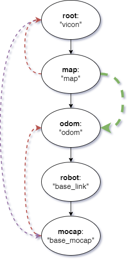

# MOCAP4R2 Robot Localization

This package implement a node to create a **map -> odom** transform from data published by a mocap system.

It search for the pose of a specific rigid body and then compute the transform according to the schema provided in the image below.

It needs a static transoform to align the root frame to the map frame. 

**Components:**
- localization_component

**Nodes:**
- localization_program

## Localization Program

**Subscribed topics:**
- rigid_body_topic

**Published topics:**
- odometry_topic

